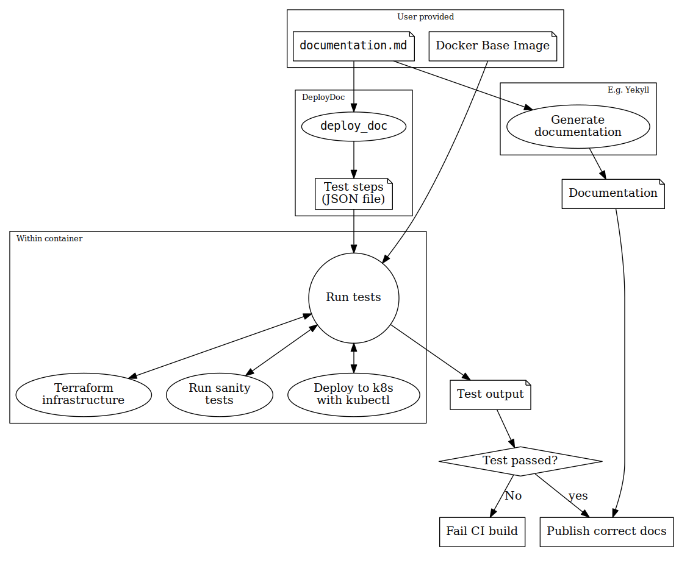

# DeployDoc

## Synopsis
With DeployDoc, you can test the deployment of your microservice constellation to multiple
platforms, based on your end user documentation.
Usually, a project will have documented the required steps to deploy the microservices.
This documentation typically consists of a text with these steps embedded in it.
We realized that by adding some annotations, these steps could be parsed by a computer and
run in a CI pipeline. See the [syntax](#syntax) section below for more information about
how to write these Markdown files.

## Architecture
- As a user, you must provide a **Markdown file** that contains the steps to set up the
  infrastructure your app requires, deploy the app to this infrastructure, and finally destroy the
  created infrastructure.
- Optionally, you can provide an alternative **Docker Image**. It defaults to the `ruby` image.
- The **`deploy_doc`** tool parses, extracts and converts the Markdown file into a JSON file which
  contains all the steps that need to be run. (See the [syntax](#syntax) section below on
  how to write these Markdown files).
- The `deploy_doc` tool creates a docker container, and mounts (a) the JSON file containing the
  steps that need to be run, (b) the runner script that interprets the JSON file and (c) the
  data dir to `/deploy_doc/data`. The runner returns an appropriate status code to communicate
  the result of the test run to the CI environment (see the [usage](#usage) section below).
- Based on the value of the test output, the CI environment can generate and publish the
  human readable and verified version version of the documentation.




## Usage
Install the `deploy_doc` gem, see the [installation instructions](#installation) below.

```
USAGE: deploy_doc <markdown_file> [options]
    -h, --help                       Print help
    -r, --run-test                   Run tests
    -j, --dump-json                  Just parse the Markdown file and dump the steps to JSON
    -c, --shell-in-container         Start a (temporary) docker container with the same environment as the tests will run in
    -i, --docker-image=IMG_NAME      Use this docker image instead of the default 'ruby:2.3'
    -d, --data-dir=DIR               Set the data directory, instead of the default '.'

EXIT STATUS:
  If all test passed, and the infrastructure has been cleaned up, 0 is returned.
  If something went wrong, but there the infrastructure has been destroyed correctly,
  a 1 error status is returned, but if the destruction of the infrastructure did not complete,
  the process returns an error status 2. These cases will probably require manual cleanup steps.
  Finally, a error status 3 is returned if the program is aborted. We cannot give any guarantees in this case!
```

NOTE: If you use a custom docker image, be sure that it contains a Ruby implementation with version >= 2.1

## Phases in a DeployDoc
The test runner has four phases:

- `pre-install`, in which required additional software should be installed, such as Terraform.
  If this phase fails, the tests just aborts, without attempting to destroy the infrastructure.
  *NOTE*: This implies that it is very important to also install any the tool that is required
  to tear down the infrastructure.
- `create-infrastructure`, in which the cloud resources are created. If this phase fails,
  the tests are skipped, but the `destroy-infrastructure` phase is executed.
- `run-tests`, which should contain instructions that validate that the infrastructure is up and
   running and that the microservices are deployed correctly.
-  `destroy-infrastructure`, which must tear down the infrastructure.

### Secrets phase
There is an additional `require-env` phase, that can be used to pass in environmental variables to
the steps. If they are not present, testing the documentation will result in an error message that
these variables are not present.


## Syntax
The expected syntax is compatible with Jekyll.
We expect the Markdown file to start with a YAML section, enclosed in a `---` delimiter.

### Defining phases and steps
Multiple shell snippets (steps) can be added to a phase.
The phases are run in the order give in the previous section, after which each snippet is executed
in the order of declaration in the file.

The following syntaxes are supported to add snippets:

 1. Single line annotation, not visible in Markdown output

        <!-- deploy-doc PHASE [VALUE]* -->

 2. Hidden multi-line annotation

        <!-- deploy-doc-start PHASE [VALUE]*
        CONTENT
        -->

 3. Visible multi-line annotation

        <!-- deploy-doc-start PHASE [VALUE]* -->
        CONTENT
        <!-- deploy-doc-end -->

Note that due to current technical limitations of the test runner, each step is executed in a
separate shell.  This implies that *setting* an environmental variable in one step, will not be
available in a next step. A work-around is to load/store this information in files.
The externally required environmental variables to store secrets are available in all steps.


### Example DeployDoc

```
---
deployDoc: true
---
# Hello World
<!-- deploy-doc require-env ENV_A ENV_B -->

<!-- deploy-doc-start pre-install -->

    apt-get update
    apt-get install -yq jq terraform

<!-- deploy-doc-end -->

<!-- deploy-doc-hidden pre-install

  curl https://nixos.org/nix/install | sh
  nix-env -i nixops

-->

<!-- deploy-doc-start create-infrastructure -->

    # This both creates the infrastructure, and
    # deploys a distributed application to it.
    nixops create -d test_deployment ./deployment.nix
    nixops deploy -d test_deployment

<!-- deploy-doc-end -->

<!-- deploy-doc-start run-tests -->

    # Get the public endpoint
    WEBAPP_HOST=`nixops export -d test_deployment | jq ' .[].resources["load-balancer"].publicIpv4' -r`

    # Test that the webapp is up.
    curl $WEBAPP_HOST

<!-- deploy-doc-end -->

<!-- deploy-doc-start destroy-infrastructure -->

    nixops destroy -d test_deployment

<!-- deploy-doc-end -->
```

## Installation

Add this line to your application's Gemfile:

```ruby
gem 'deploy_doc'
```

And then execute:

    $ bundle

Or install it yourself as:

    $ gem install deploy_doc

## Development of this gem

After checking out the repo, run `bundle install` to install dependencies.
Then, run `rake test` to run the tests.
You can also run `bin/console` for an interactive prompt that will allow you to experiment.

To install this gem onto your local machine, run `bundle exec rake install`.
To release a new version, update the version number in `version.rb`, and then run
`bundle exec rake release`, which will create a git tag for the version, push git commits and tags,
and push the `.gem` file to [rubygems.org](https://rubygems.org).

## Contributing

Bug reports and pull requests are welcome on GitHub at https://github.com/microservices-demo/deploy_doc.
This project is intended to be a safe, welcoming space for collaboration, and contributors are
expected to adhere to the [Contributor Covenant](http://contributor-covenant.org) code of conduct.

## License

The gem is available as open source under the terms of the [MIT License](http://opensource.org/licenses/MIT).
